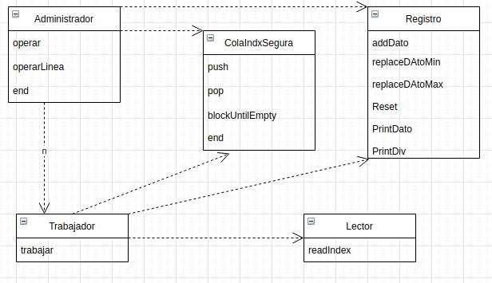

# tp2
## Amando Tomás Civini
## https://github.com/ArmandoCivini/tp2.git
Para este TP se usó c++. Se hizo uso de sus clases, manejo de threads y RAII para construir un programa que procesara los datos de un archivo mediante multiples trabajadores.

### Clase Administrador
Esta es la clase en donde comienza el flujo del programa y la que se encarga de manejar los recursos. La primera tarea que hace es iniciar los hilos en donde se procesaran los datos del archivo, en cada uno de ellos se ubica un Worker para realizar la tarea. La siguiente tarea de esta clase es crear las divisiones para que cada worker lea del archivo. Esto se hace mediante un TDA llamado file_indx, el cual contiene el bit donde empezar a leer, cuantos bits leer del archivo, en que columna operar y que operacion hacer. Toda esta es la informacion que nesecitan los Workers para realizar su tarea. Estas particiones son puestas en una cola threadsafe (SafeQueueString) para ser retiradas por los workers. Las particiones del archivo suceden cada vez que el usuario ingresa un comando por stdin y Administrador se bloquea hasta que los workers terminan de trabajar para asi imprimir el resultado de la operacion y reiniciar el registro para el siguiente commando.
### Clase Worker
Esta es la otra clase principal de este proyecto. Es una clase diseñada para trabajar concurrentemente por lo que sus recursos los utiliza con clases threadsafe, tanto SafeQueueString como Registro. El trabajador utiliza SafeQueueString para retirar la particion que le corresponde operar de ella, para luego usarla junto a File_parser (esta clase es unica de cada worker como se puede ver en el diagrama) para retirar El vector de numeros a operar. Luego de procesar los datos, Worker envia su resultado a la clase Registro que es otro de los recursos compartidos y procede a sacar otro elemento de la cola.
### Clase SafeQueueString
Esta clase es la cola que se encarga de cordinar a los trabajadores con el hilo principal para llevar a cabo las tareas. La primera particularidad de esta cola es que es threadsafe, esto lo logra haciendo uso de un mutex en sus operaciones para que en ningun momento dos hilos puedan operar en esta simultaneamente. Su otra particularidad es que es bloqueante en el pop por lo tanto de no haberse terminado la ejecucion pero que su cola este vacia, cuando se haga un pop en esta ese hilo quedara blockeado hasta que se haga un push. De haber multiples hilos bloqueados al hacerse un push solo se desbloquea uno de estos. Se usa la funcion end cuando se quiere avisar a los usuarios de la cola que se dejaran de pushear elementos. Finalmente en este tp se usa la funcion blockUntilEmpty de la cola para blockear el hilo principal hasta que la cola este vacia para asi esperar a que los trabajadores terminen de procesar los datos antes de imprimir un resultado.

### Clase  File_parser
En construccion, esta clase recive el nombre de un archivo que va a abrir hasta ser destruida. Al hacer uso de read_indx se leera este archivo a partir del comienzo del file_indx pasado por paramentro y se leera la cantidad de bits bytes especificada. Con estos bytes se formaran numeros de 16 bits los cuales se ingresaran al vector por el cual seran devueltos.
### Clase Registro
Registro es la otra clase threadsafe del trabajo. Esta se usa para ir guardando los datos que procesan los workers para luego imprimirlos por pantalla. Tiene distintas formas de agregar el dato segun la operacion que hizo el worker, por ejemplo si el worker busco el minimo entre sus datos, el llamara a replaceDatoMin ya que si el resultado que se encontraba en el registro es menor no se hara el remplazo. Tambien cuenta con la opcion de imprimir el dato o el dato dividido la cantidad de datos que se procesaron.
